# N1刷入armbian debain系统

## 前言

此系统可玩性高

## 第一步：软硬件准备（已经帮你们在网盘里准备好了）

工具包下载地址：[网盘地址](https://pan.baidu.com/s/1F2e_2i0gICaadYuAfwBHOw) , 提取码：vyi7

1. N1盒子一个

2. 键盘、鼠标、显示器、HDMI线、USB双公线、8G以上U盘

3. 电脑，能开机的

4. 软件：PuTTY （SSH）或者Xshell，Win32DiskImager（把ArmBian写入U盘），N1-ADBU盘启动，WinScp（往盒子里上传还原备份），N1-T1降刷机助手v1.1版本、Amlogic USB Burning Tool_v2.1.6.8

5. ArmBian5.77

6. xiangsm大佬修改的dtd文件（meson-gxl-s905d-phicomm-n1-xiangsm.dtb）

## 第二步：给N1盒子降级（这个操作N1盒子这辈子都只用一次）

### 降级工具

 斐讯T1、N1官方系统降级工具.zip

### 打开盒子的ADB功能

1. 盒子插网线接入和电脑同一局域网，记下盒子获得的内网IP地址；N1在主界面使用鼠标点击四次固件版本号打开adb：

     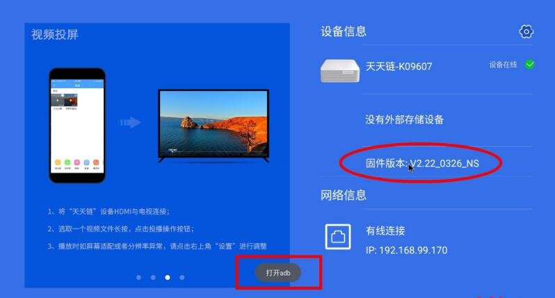

2. 在电脑端保持目录结构解压 斐讯T1、N1官方系统降级工具.zip；

3. 电脑端运行 onekey 子目录下的 run.bat ，按提示操作：

   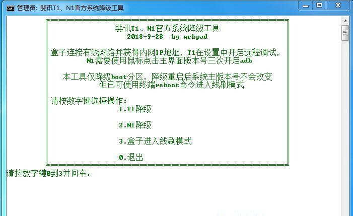

   选择N1降级

   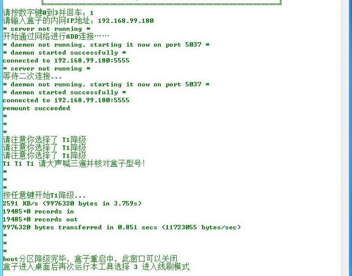

## 第三步：U盘镜像写入工具

     使用工具：Win32DiskImager

1. 将一个8G以上的U盘插入电脑，然后选择下载的Armbian_5.77镜像写入，注意别写错U盘。

2. 打开软件写入镜像

     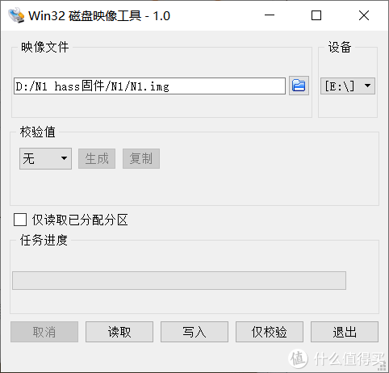

     选择好U盘

     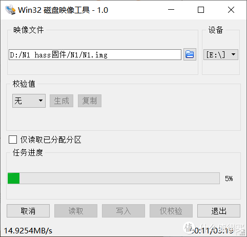

     别的都不动，写入

     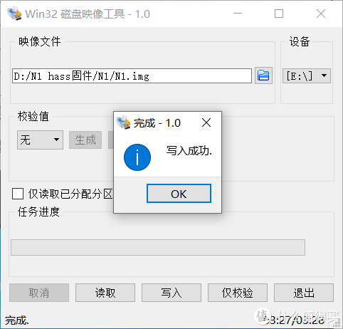

     写入成功

     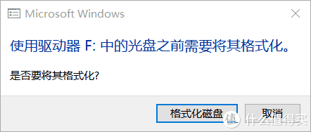

     提示格式化

     这里千万别格式化！千万别格式化！千万别格式化！

## 第四步：修改引导dtb

有的img可能是已经修改好的，但是我保证，我这个真没改，这是官网上直接下的

1. 进我的电脑，找到BOOT

     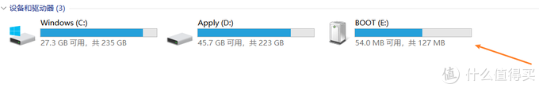

     这就是格式化之后可以显示的boot分区

2. 把下载的的dtb文件拷进去

     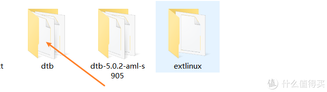

     把下载的的dtb文件拷进dtb文件夹去

3. 打开uEnv.ini,修改配置

     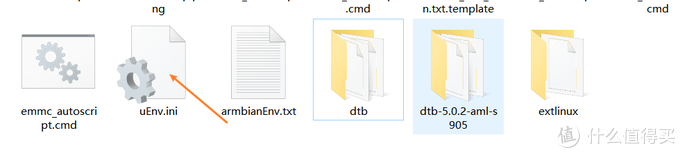

     打开uEnv.ini

     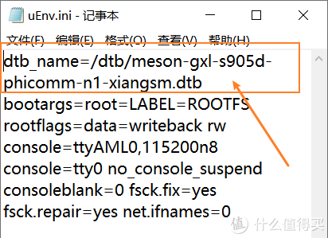

     我知道看着打字比较麻烦，所以直接抄就好了。完事CTRL+S保存

         dtb_name=/dtb/meson-gxl-s905d-phicomm-n1-xiangsm.dtb

## 第四步：引导从U盘启动

   使用工具：N1-ADBU盘启动工具

1. N1-ADBU盘启动工具进行引导

     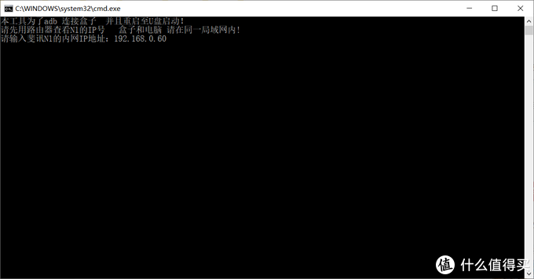

     输入IP 我的是 192.168.0.60

     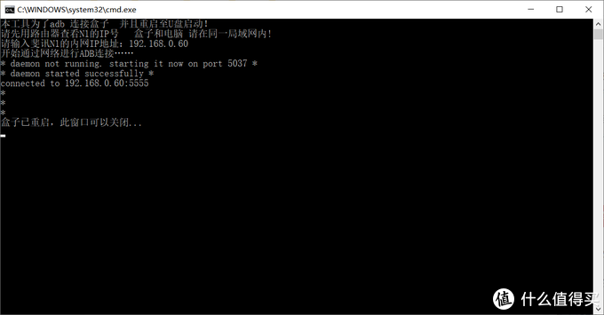

     然后ok

2. 将U盘插入靠近HDMI的U口里，上电重启，会自动进入U盘系统。

     然后开始疯狂跑代码

     下面的图片是手机拍的，见谅。

     

     默认用户名：root 密码：1234

     输入后会要求提示修改密码，先输入一遍旧密码1234，再输两遍新密码。

     密码长度大于8个字符，修改后，提示新建账户，直接按Ctrl+C跳过，再次输入登录。

## 第五步：镜像写入eMMC

1. 电脑上打开Putty或者Xshell，我用Putty，免安装。

     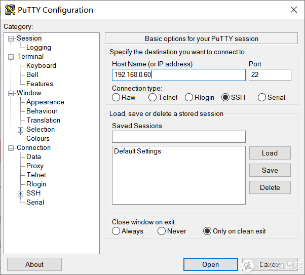

     只输入ip地址，别的不用动

     为了保证不输错，保险起见，你可以看下你的N1

     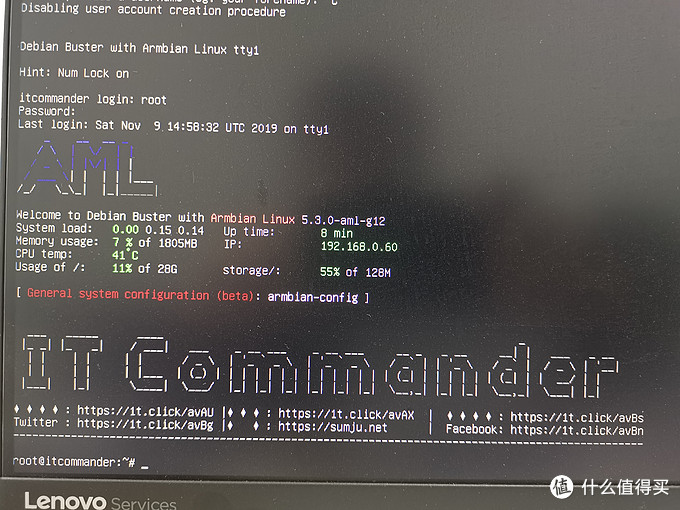

     这里面有IP

     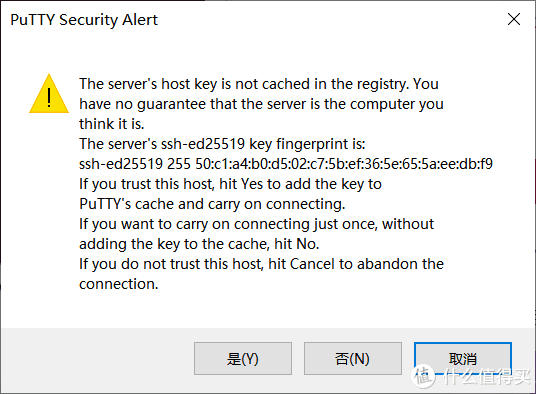

     提示你，选是 不选是进不去

     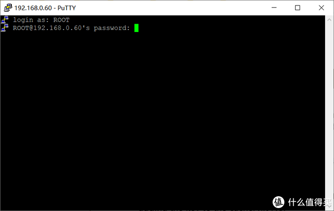

     输入的是你已经改过的账号密码

2. 输入代码，安装镜像至EMMC

     这里的命令各家可能不同，咱也不敢多说，按我这条命令输，别玩两天没法进系统了
     CTRL+C 复制命令后，在命令窗口右键即可复制，一个一个字打容易出错

         nand-sata-install

     它可以完成所有刷写eMMC所需的事情

     出现"Complete copy OS to eMMC"，就代表写入完成了

     完成后，输入命令关机，拔电源也行

         shutdown

     关机拔掉U盘，所有刷机工作就结束了。

     这里多说一句，如果你想重刷Armbian系统，那么还是U盘启动Armbian，重新执行nand-sata-install即可完整覆盖掉emmc中的数据，不必重刷安卓再刷Armbian。
